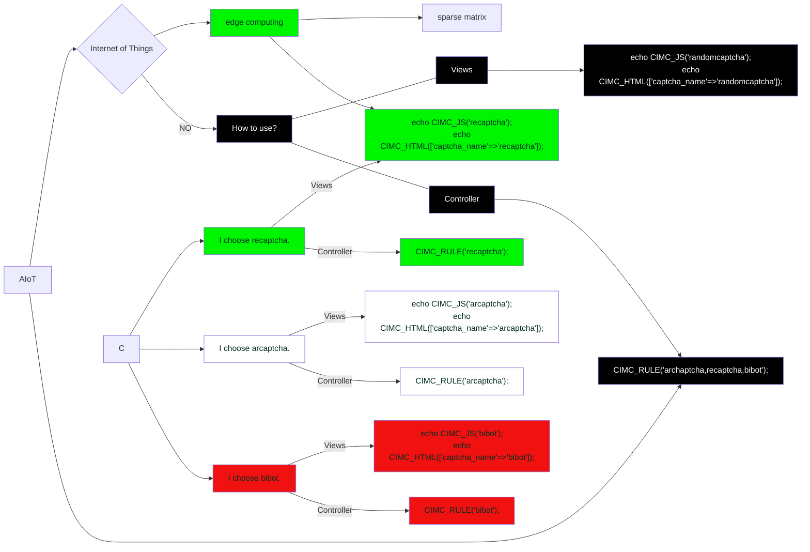
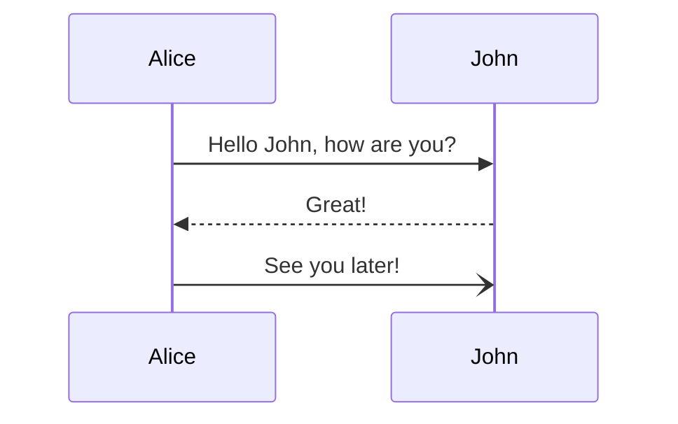
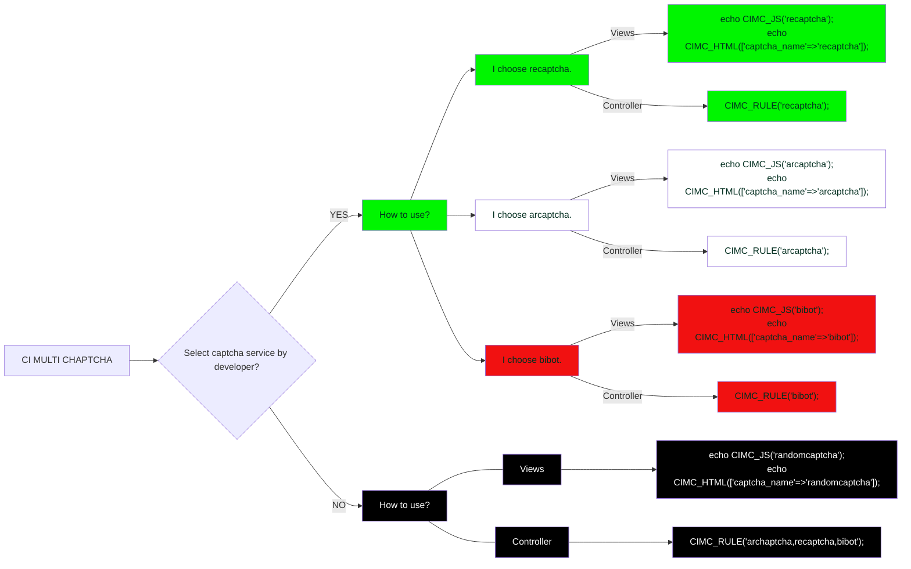
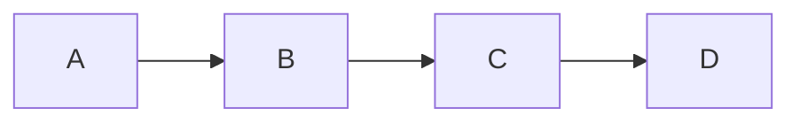

# AI-course
A concise two-column blog theme for Jekyll.

| 日期 | 标题 | 封面 | 时长 | 视频（播放数） |
| --: | -- | -- | --: | -- |
| 1/11/23 | 多模态论文串讲·下 |   | 1:03:29 |    |
| 12/29/22 | [Instruct GPT](https://arxiv.org/pdf/2203.02155.pdf) |  | 1:07:10 |    |
| 12/19/22 | [Neural Corpus Indexer](https://arxiv.org/pdf/2206.02743.pdf) 文档检索 |  | 55:47 |    |

### mermaid

    
Toggle Switch

    Foldable Content[enter image description here][1]

	

