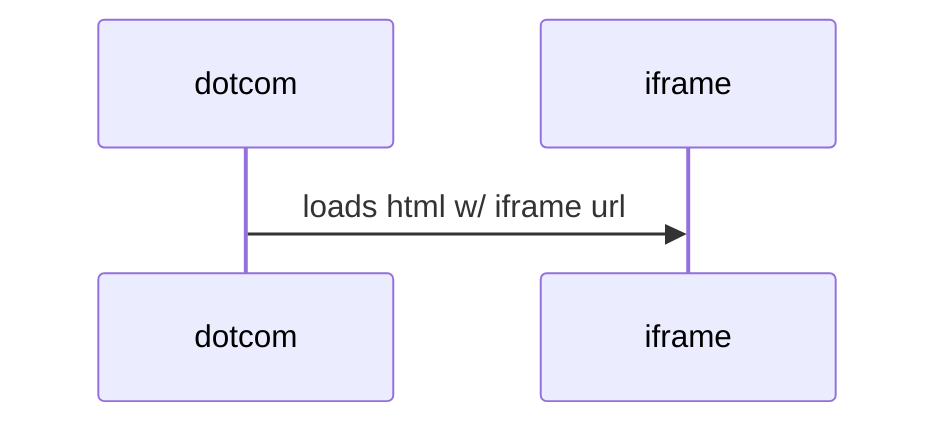
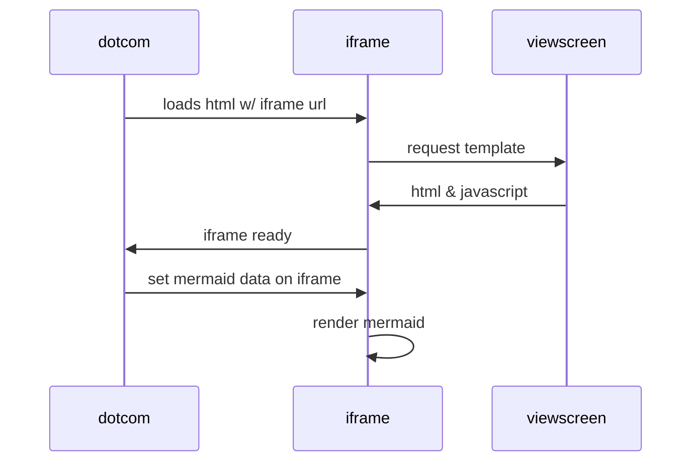
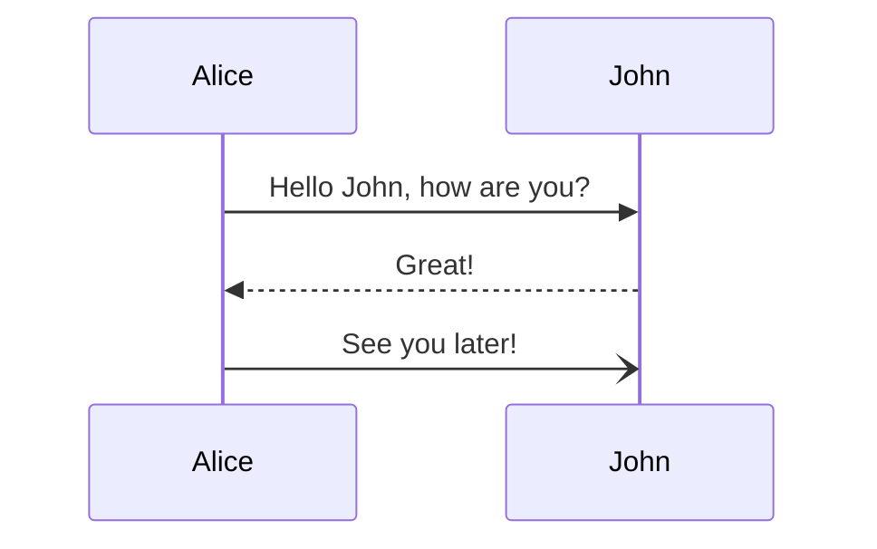
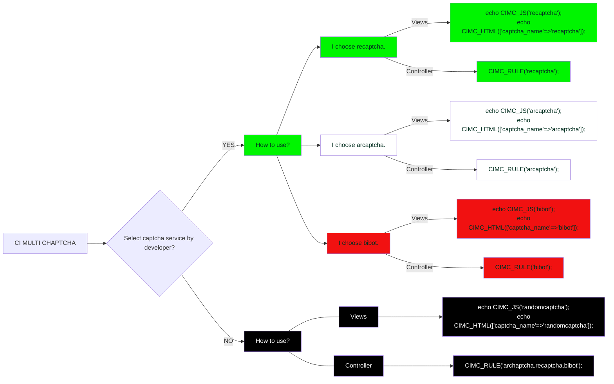

Gibraltar as a girl where I was a Flower of the mountain yes when I put the rose in my hair like the Andalusian girls used or shall I wear a red yes and how he kissed me under the Moorish wall and I thought well as well him as another and then I asked him with my eyes to ask again yes and then he asked me would I yes to say yes my mountain flower and first I put my arms around him yes and drew him down to me so he could feel my breasts all perfume yes and his heart was going like mad and yes I said yes I will Yes.

---

### mermaid

    
Toggle Switch

    Foldable Content[enter image description here][1]

## Lesson

https://rkuo2000.github.io/AI-course/

[lesson 4]2022-10-06-Image-Classification

Transer Learning

https://www.kaggle.com/datasets/rkuo2000/animes
	

### RL-gym
---
pip install pyglet==1.5.27
pip install stable_baselines3[extra]
pip install gym[all]
pip install autorom[accept-rom-license]
git clone https://github.com/rkuo2000/RL-gym
cd RL-gym

pip install box2d-py 

cd RL-gym
cd sb3

python train.py LunarLander-v2 640000
python enjoy.py LunarLander-v2
python enjoy_gif.py LunarLander-v2

python train.py lunar_Lander-v2 640000

python train.py LunarLander 640000

AttributeError: module 'gym.envs.box2d' has no attribute 'LunarLander'

raise error.UnregisteredEnv("No registered env with id: {}".format(id))
gym.error.UnregisteredEnv: No registered env with id: lunar_Lander-v2

A.L.E: Arcade Learning Environment (version 0.7.4+069f8bd)
[Powered by Stella]
C:\Users\user\AppData\Local\Programs\Python\Python310\lib\site-packages\stable_baselines3\common\save_util.py:166: UserWarning: Could not deserialize object lr_schedule. Consider using `custom_objects` argument to replace this object.
  warnings.warn(

### facemet
---

[message]too many values to unpack (expected 2) 
 
[reference]https://www.pythonpool.com/valueerror-too-many-values-to-unpack-expected-2-solved/
 
[solution] 
 
aligned = []
names = []
for x, y in loader:
    x_aligned, prob ,*unpack= mtcnn(x, return_prob=True)
       if x_aligned is not None:
         #print('Face detected with probability: {:8f}'.format(prob))
        aligned.append(x_aligned)
        names.append(dataset.idx_to_class[y])

print(len(aligned))
print(names)

### MMPose
---

鄭濬緯 
 
!pip install scipy==1.3.1 
 
rkuo2000 
rkuo2000：我殺掉舊的, 重新按github的重新跑  
rkuo2000：應該是安裝問題  
rkuo2000：pip install -e . 就可以了<> 
	

*This site was last updated {{ site.time | date: "%B %d, %Y" }}.*
